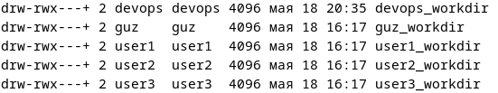

# Домашняя работа по DevOps
Хазратова Гузель, группа 11-207
## Содержание

[Задание 1](#задание-1-написание-скрипта)

[Задание 2](#задание-2-написание-playbook)

[Задание 3](#задание-3-написание-dockerfile)

[Задание 4](#задание-4-написание-docker-compose)

## Задание 1. Написание скрипта

### Запуск скрипта
1. Если путь указан:

2. Если путь не указан - запрашивается:

### Выполненные задачи:
1. Создание группы dev и добавление несистемных пользователей (основной + несколько созданных user для примера)

2. Настройка права sudo

Проверяем как работает на user1:

3. Создание рабочей директории

Информация о пользователе

Проверяем параметры:

4.  Вывод:

    a) В консоль (на первом изображении)

    b) В лог файл

## Задание 2. Написание playbook
### Запуск playbook

### Выполненные задачи:
1. Подключение по SSH - проходит

2. Создание пользователя, который находится в группе sudo

3. У папки .ssh все необходимые права и файл authorized_keys содержит нужный ключ

4. Установка необходимых параметров SSH в конфиге

5. Рабочая директория создана с необходимыми правами

## Задание 3. Написание Dockerfile
Пояснения по работе: Dockerfile создаёт образ на основе Debian, устанавливает nginx и postgres. Конфиг nginx добавлен, потому что он нужен для настройки веб-сервера, а конфиг postgres - нет, так как в данном случае используются стандартные настройки БД и nginx будет работать независимо от postgres. 

Контейнер запускает оба сервиса, а также монтирует том для хранения данных БД.

HTML-страничка index.html добавляется в образ для отображения простой веб-страницы при обращении к контейнеру.

### Сборка образа 

### Cлои image и их размер на диске

### Запуск контейнера

### Проверка доступности nginx

## Задание 4. Написание Docker Compose

Пояснения по работе: Docker Compose файл разворачивает два сервиса: веб-сервер nginx на порту 8080 и базу данных postgresql, соединенные через пользовательскую сеть custom_bridge с фиксированными IP-адресами.

Nginx настроен через конфигурационный файл для вывода тестового сообщения, а PostgreSQL использует именованный том для хранения данных и имеет заданные переменные окружения.

### Запуск контейнеров

### Проверяем, что оба контейнера запустились

### Проверка доступности nginx

### Проверка соединения между контейнерами

### Подробная информация о volume
