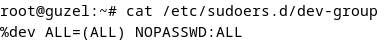

# Домашняя работа по DevOps
Хазратова Гузель, группа 11-207
## Задание 1. Написание скрипта

### Запуск скрипта
1. Если путь указан:

2. Если путь не указан - запрашивается:

### Выполненные задачи:
1. Создание группы dev и добавление несистемных пользователей (основной + несколько созданных user для примера)

2. Настройка права sudo

Проверяем как работает на user1:

3. Создание рабочей директории

Проверяем параметры:

4.  Вывод:

    a) В консоль (на первом изображении)

    b) В лог файл

## Задание 2. Написание playbook
### Запуск playbook

### Выполненные задачи:
1. Подключение по SSH - проходит

2. Создание пользователя, который находится в группе sudo

3. У папки .ssh все необходимые права и файл authorized_keys содержит нужный ключ

4. Установка необходимых параметров SSH в конфиге

5. Рабочая директория создана с необходимыми правами

